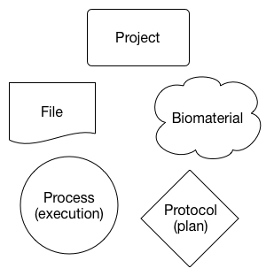
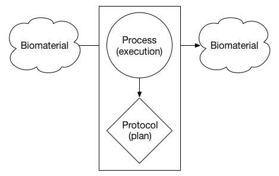
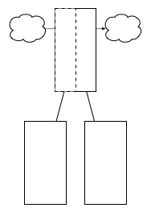

# The Human Cell Atlas Metadata Structure Overview - v3.0

This document describes HCA metadata schema design principles and standards and the semantics for versioning and updating these schema. More detailed discussion of the format and syntax of the metadata schema and their instantiation can be found in the complementary [Metadata schema structure specification](https://docs.google.com/document/d/1pxQj7BfM8HHgD4ilm4dlvZuZATfJkNC5s_-TUoA4lYA/edit?ts=59b16455) document on Google Drive. The metadata working group will review this process on a yearly basis and ensure it is meeting the needs of the working group. If at any point the process becomes problematic, changes should be made to ensure metadata update is not a blocker for the consortium as a whole.

## Table of Contents
- [High-level description](#high-level-description)
- [Entity structure](#entity-structure)
- [Principles](#principles)
- [Stakeholders](#stakeholders)

## High-level description

The Human Cell Atlas (HCA) is collecting data from complex biological samples and assays with rich information (metadata). We expect over the lifetime of the project that the schemas that captures these metadata will need to change. These changes will always be to support the main goal of the HCA Data Coordination Platform (DCP): enabling downstream use and interpretation of the data. As our understanding of the data changes, the metadata we need may also change. The schemas, therefore, will also need to evolve to support new assays and changing practices in the contributing labs as the precise steps conducted for a particular assay are improved.

## Entity structure

### Overview

There are five major entities supported by the HCA metadata standard: Projects, Biomaterials (i.e. samples), Protocols, Processes, and Files.

The entities are arranged in units the represent different parts of an experiment. For example, the diagram below is an abstract illustratation of an input *biomaterial* (*e.g.* a tissue sample) undergoing some *process* (*e.g.* dissociation) to produce another *biomaterial* (*e.g.* a sample of dissociated cells). The *process* that was actually executed followed a specific *protocol* - or intended plan - to produce the output *biomaterial*.

The metadata entity model supports units that can have either biomaterials or data files as input or output. If the input is a biomaterial and the output is a data file, we typically refer to this as an assay. If both the input and output is a data file, we refer to this as an analysis. This flexible model also allows for the possibility of modeling synthetic biology experiments - for example a data file is used as input to produce a custom biomaterial - in the future.

**Wrapper processes**

### Primary goals

The primary goals of the HCA metadata entity model we developed include:

1. Process-based schema for handling transitions between biomaterial and file entities
1. Modular schemas to support independent versioning and domain-specific metadata fields
1. Flexible and reusable metadata structure to enable modeling of future experiment types

### Metadata field organisation 

* *Core* = Very stable, high-level entities that are referenced by a respective *Type*. These entities contain core fields that apply to and are inherited by corresponding *Type* entities.
* *Type* = An entity that is a specific instance of *Core* entity type. These entities contain fields specific to that *Type* and inherit core fields from the corresponding *Core* entity.
* *Module* = Small, evolvable entities that are extensions of an existing *Type* entity. These entities contain extra fields specific to a *Type* but are domain- or user-specific.

## Principles

The HCA metadata standards must be created and updated in a transparent and open manner ensuring the whole community can participate in the process if they wish. The following principles will be adhered to for the update process.

### Agility

The HCA foresees active development of sample handling, assays, and analyses, and will include both stable and rapidly evolving methods. As such, the metadata schema needs to be able to adapt accordingly, with regular updates (e.g. weekly or monthly), and a process for managing and tracking schema and data versions.

### Modularity

As the metadata evolves, different components will likely evolve at different rates than others -- for example, the specification of contact info may never change, whereas entirely new objects will be required when a new experimental technology is invented. A modular design will ensure that different components of the metadata can flexibly and independently evolve. 

### Flexibility

Significant experimental diversity is expected. Our methods for iterating metadata must allow for both the flexible capture of new data variants (e.g. new experimental assays), as well as the subsequent easy adoption of new schema as methods reach common usage. Any data contributor should always be able to add arbitrary additional fields to the metadata objects without causing process failure.

### Separation of (metadata) Concerns

It must be possible to separate different concerns related to metadata. For example, the metadata validation process should be driven by the schema, and depend only on having access to the schema, not the particular content of the schema or its semantics. Similarly, it should be possible to store the metadata on disk without understanding its syntax or semantics.

## Stakeholders

The HCA community is broad and has many participating groups. The metadata update process needs to be transparent and easy to access for all these groups. One important issue to face is ensuring that anyone who is not comfortable with the git interface is not blocked from making metadata update suggestions. 

### Collectors and users of the data

#### Data Contributing Labs

Data contributing labs are the groups who collect the samples and run the assays that generate the data for the HCA. They will be the individuals who have to record and report the majority of the metadata specified. The update and review process needs to be accessible to these groups and we must strive to ensure that they can easily find and incorporate changes in their own processes.

#### Ingest Brokers

The ingest brokers are the primary DCP contact with the data contributing labs. It is likely that a significant proportion of update requests will come via the ingest broker teams as they interact with the contributing labs and have a strong connection to the biology of the HCA. They should have a keen understanding of the capabilities of the contributing labs they are supporting and be able to comment on the reasonableness of change or addition to the rules with regard to the labs they support.

#### Secondary Analysis Pipelines (MINT) team
The secondary analysis pipelines will use metadata to discover and run their analysis pipelines. The impact of any changes on how pipelines discover data and run must be understood and where appropriate a member of the secondary analysis pipelines team should be involved in the review.

#### HCA data access portal team

The Data Access Portal (DAP) will be a simple file/bundle browser for the Data Storage System (DSS).  The DAP will use the metadata to build one or more indexes used to search for files and data bundles by a variety of configurable “facets”.  Changes to the metadata schema may alter how the indexer(s) are coded and how these search indexes get built.  The release of metadata versions should be coupled to updates of the indexers (and potentially web UI) by the DAP group..

#### Third party portal developers

The portal developers will use the metadata to build views and querying services on the data. Changes to the metadata schema may alter how these services are built. Portal developers must have access to the update and review process to ensure any downstream consequences on their own processes can be assessed and where necessary acted on.

#### Tertiary methods developers and other downstream users of the data

The metadata also needs to facilitate the all users of the data, whether they access it directly from the data store or via services provided by the different portals. This process must be visible and accessible to all our users.

### Software teams

The majority of metadata updates should have no impact on the software teams and should not require any downstream software updates but occasionally such breaking changes will be necessary.

#### Ingest API team

The Ingest API team should only need to be involved in the metadata update process if fields are updated which require changes to the Ingest API. This should be a very rare event and would require a longer consultation before making the change. The other class of change which would need consultation with the Ingest API is anything where semantic validation is required but the current schema validation tools are not able to validate yet. The schema allows for  additional metadata fields to be defined by a submitter beyond the fields already captured by the schema. This means submitters can always provide additional descriptive data to the DCP without it being officially part of the schema. If the suggested change require validation software updates to be scheduled, an individual submitter should be able to move forward with a change before the new validation is possible.

#### DSS team

The Data Storage System includes automated indexing of files marked as "metadata" in data bundles uploaded to the system. The current primary, "non-transformative" index takes documents as they are and loads them into an Elasticsearch index. This primary, non-transformative index can then be 1) queried, resulting in paged results pointing to individual bundles and/or 2) queries can be registered ahead of time and new data bundles (data bundle versions) whose metadata matches the queries will trigger notifications to a system associated with that registered query.

This approach is extremely flexible from a project metadata perspective. Many different projects can be supported in a DSS with a non-transformative indexing strategy because this strategy does not need to understand the format of the metadata for a project ahead of time. One limitation of this strategy is related to changes over time. In particular, the Elasticsearch indexing technology we are currently using is sensitive to changes in metadata key/value types, e.g. the value of "species" changing from a string "homo sapiens" to a complex type "{ `name` : `homo sapiens`, `ontology`: 817 }".  For this reason, we want to use semantic versioning for each metadata document, such that breaking changes like this can be predicted by simply examining the top-level document schema version number. Elasticsearch can then place conflicting schemas in different indexes (yet dynamically combine their content in searches). This is the solution, and resulting limitation, we have currently.

