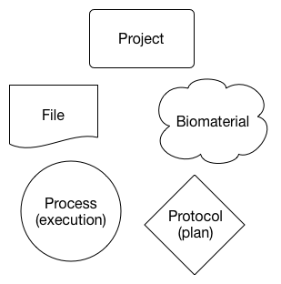
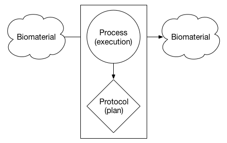
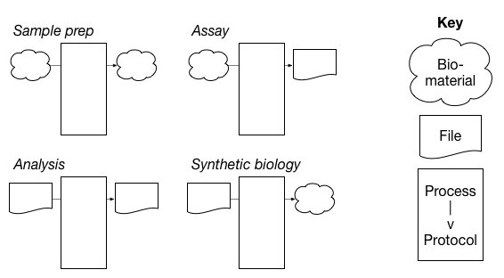
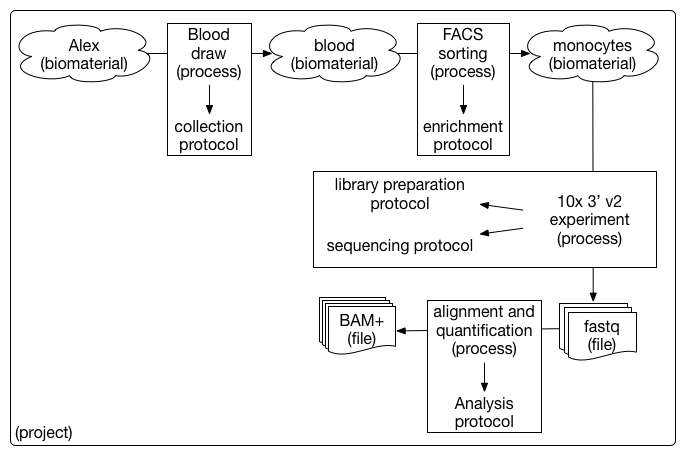

# The Human Cell Atlas: Overview of Metadata Structure

## Table of Contents
- [Introduction](#introduction)
- [Structure overview](#structure-overview)
- [Specifying JSON schemas](#specifying-json-schemas)

## Introduction

This document describes the structure of the HCA metadata standard as implemented and utilized by the Data Coordination Platform (DCP). More detailed specification of the format and syntax of the metadata schemas and their instantiation can be found in the [metadata schema structure specification](https://docs.google.com/document/d/1pxQj7BfM8HHgD4ilm4dlvZuZATfJkNC5s_-TUoA4lYA/edit?ts=59b16455) on Google Drive.

**What is in this document?**
 - High-level [overview of the schema structure](#structure-overview)
 - Description of [schema URL structure](#specifying-schema-urls)

**Who should be reading this document?**
 - Data contributors
 - Data consumers
 - Members of external projects seeking alignment with HCA metadata standards

**What *isn't* in this document?**
 - The set of [principles](rationale.md#design-choices) specifically guiding the schema structure design
 - How metadata standard is [semantically versioned](evolution.md#schema-versioning)

## Structure overview

### Motivation

The primary motivations for having a structured HCA metadata standard are to:

1. Enable data contributors to describe their project in a way that produces high-quality data that can be maximally exploited by consumers and developers
1. Enable data consumers to interpret data efficiently and in a standardized way
1. Support developers who rely on metadata to develop and implement analysis and visualization tools
1. Adhere to [FAIR data principles](https://www.force11.org/group/fairgroup/fairprinciples) ([paper](https://www.nature.com/articles/sdata201618))


The primary motivations for the entity model chosen to describe the HCA metadata standard are to:

1. Handle transitions between biomaterial and file entities
1. Enable independent versioning of schemas representing different entities
1. Support modeling of future sample and experiment types without needing to drastically alter the current model

### Metadata entity model

There are five major entities supported by the HCA metadata standard: Projects, Biomaterials (biological samples), Protocols, Processes, and Files.



The entities are arranged in units that represent different parts of an experiment. For example, the diagram below is an abstract illustration of an input *biomaterial* (*e.g.*, a tissue sample) undergoing a *process* (*e.g.*, dissociation) to produce another *biomaterial* (*e.g.*, a sample of dissociated cells). The *process* that was executed followed a specific *protocol* - or intended plan - to produce the output *biomaterial*.



The metadata entity model supports units that can have one or more biomaterials or files as inputs or outputs. If both the input and output of a process are biomaterials, this unit represents some form of sample preparation. If the input is a biomaterial and the output is a file, the unit represents what many scientists refer to as an "assay". If both the input and output of a process are files, the unit represents an analysis. This flexible model allows for the possibility of modeling synthetic biology experiments - for example a file is used as an input to produce a custom biomaterial - in the future.



Below is an example single cell sequencing experiment modeled using the HCA metadata entity model.



### Metadata field organization 

Each instance of a project, biomaterial, protocol, process, and file entity is represented by a specific *Type* metadata schema. For example, in the HCA metadata standard each donor biomaterial is represented and described by the donor schema. Each Type schema includes a set of fields specific to describing that particular entity, and also inherits a set of core fields for that entity type - represented in a *Core entity* schema - and an optional set of thematically related fields - each set represented in a *Module entity* schema.

- *Type entities* = A specific instance of a project, biomaterial, protocol, process, or file entity. Type entities contain fields specific to that Type and inherit core fields from the corresponding Core entity.
- *Core entities* = Very stable, high-level entities that are referenced by Type entities. Core entities contain fields that apply to and are inherited by all corresponding Type entities.
- *Module entities* = Small, flexible entities that are extensions of an existing Type entity. Module entities contain extra fields related to a Type but that are thematically related.

### User-supplied versus ingest-supplied metadata fields

Most metadata fields in Core, Type, and Module schemas are provided by data contributors during the submission process. A subset of fields in the metadata standard, however, are provided by the Ingestion Service component of the DCP. These ingest-supplied fields include the following:

- `provenance` field in all Type schemas
- `describedBy`, `schema_version`, `schema_type` fields in all schemas
- all fields in `links.json` and `provenance.json` schemas

Ingest-supplied fields contain metadata about the submission (*e.g.* when metadata was uploaded to the DCP) and about the schema being used. Data contributors will never submit values to these fields directly.

In addition to ingest-supplied metadata fields, the `ontology` and `ontology_label` fields present in all ontology schemas will be populated by a look-up service based on the value supplied by data contributors in the corresponding `text` field in each ontology schema.

### Recording the standard

The metadata standard is stored as a series of individual schemas which represent the entities and fields associated with them (*e.g.*, `project.json`, `biomaterial_core.json`, `sequencing_protocol.json`). The schemas are stored in a single versioned control GitHub repository alongside documentation about the schema, the meaning of their content, and the update process. Anyone can propose changes to the schema through GitHub pull requests and issues. Only a specific list of committers will be allowed to approve pull requests and release new versions of the metadata schemas.

## Specifying JSON schemas

### Self-describing metadata schemas

Each JSON metadata schema is self-describing using the `$id` field with a URL to the location of that specific version of the schema. 

In the `donor_organism.json` schema, the `$id` field looks like: 

    {
        "$schema": "http://json-schema.org/draft-07/schema#",
        "$id": "https://schema.humancellatlas.org/type/biomaterial/10.1.1/donor_organism",
        ...
    }

### Self-describing metadata documents

Each metadata document for a Type entity requires a property - `describedBy` - that explicitly records the URI of the metadata schema which represents it.  

In the `donor_organism.json` schema, the `describedBy` field is specified as: 

    "describedBy": {
        "description": "The URL reference to the schema.",
        "type": "string",
        "pattern": "^(http|https)://schema.(.*?)humancellatlas.org/type/biomaterial/(([0-9]{1,}.[0-9]{1,}.[0-9]{1,})|([a-zA-Z]*?))/donor_organism"
    }
    
In a metadata document representing a Donor organism entity, the `describedBy` field is expressed as:

    {
        "describedBy": "http://schema.staging.data.humancellatlas.org/type/biomaterial/10.1.1/donor_organism",
        ...
    }

### Schema URI structure

The structure of metadata schema URIs follows the convention:

`http://schema.humancellatlas.org/{primary_directory}/{secondary/directory/structure}/{version}/{unqualified_schema_name}`

where

- `{primary_directory}` is one of [`core`, `type`, `module`]
- `{secondary/directory/structure}` describes the path to the schema, *e.g.* `biomaterial`, `process/sequencing`
- `{version}` is the version number of the schema, *e.g.* `10.1.1`
- `{unqualified_schema_name}` is the unqualified name of the schema, *e.g.* `donor_organism`

Some example URIs include:

```
http://schema.humancellatlas.org/core/biomaterial/5.0.1/biomaterial_core
http://schema.humancellatlas.org/type/biomaterial/5.0.0/cell_line
http://schema.humancellatlas.org/type/protocol/sequencing/5.0.0/library_preparation_protocol
http://schema.humancellatlas.org/module/ontology/5.0.0/cell_type_ontology
http://schema.humancellatlas.org/module/process/sequencing/5.2.0/barcode
```
