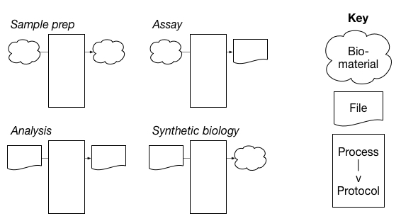
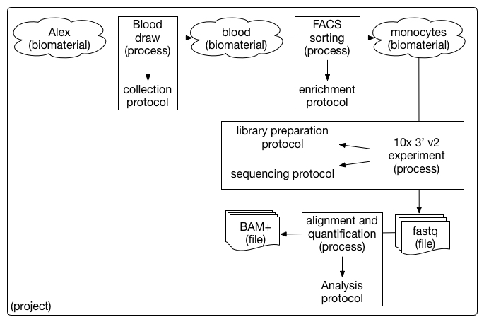

# The Human Cell Atlas: Overview of Metadata Structure

## Table of Contents
- [Introduction](#introduction)
- [Structure overview](#structure-overview)
- [Specifying schema URLs](#specifying-schema-urls)

## Introduction

This document describes the structure of the HCA metadata standards. More detailed specification of the format and syntax of the metadata schemas and their instantiation can be found in the [metadata schema structure specification](https://docs.google.com/document/d/1pxQj7BfM8HHgD4ilm4dlvZuZATfJkNC5s_-TUoA4lYA/edit?ts=59b16455) on Google Drive.

**What is in this document?**
 - High-level [overview of the schema structure](#structure-overview)
 - Description of [schema URL structure](#specifying-schema-urls)

**Who should be reading this document?**
 - Data contributors
 - Data consumers
 - Members of external projects seeking alignment with HCA metadata standards

**What *isn't* in this document?**
 - The set of [principles](rationale.md#design-choices) specifically guiding the schema structure design
 
## Structure overview

### Motivation

The primary motivations for the HCA metadata entity model are to:

1. Handle transitions between biomaterial and file entities
1. Enable independent versioning of schemas representing different entities
1. Support modeling of future sample and experiment types easily and without needing to drastically alter the current entity model

### Entities

There are five major entities supported by the HCA metadata standard: Projects, Biomaterials (samples), Protocols, Processes, and Files.


The entities are arranged in units that represent different parts of an experiment. For example, the diagram below is an abstract illustration of an input *biomaterial* (*e.g.*, a tissue sample) undergoing a *process* (*e.g.*, dissociation) to produce another *biomaterial* (*e.g.*, a sample of dissociated cells). The *process* that was executed followed a specific *protocol* - or intended plan - to produce the output *biomaterial*.


The metadata entity model supports units that can have one or more biomaterials or files as inputs or outputs. If the input is a biomaterial entity and the output is a file entity, the unit represents an assay. If both the input and output entities are files, the unit represents an analysis. This flexible model allows for the possibility of modeling synthetic biology experiments - for example a file is used as an input to produce a custom biomaterial - in the future.



Below is an example single cell sequencing experiment modeled using the HCA metadata entity model.



### Metadata field organisation 

* *Core entities* = Very stable, high-level entities that are referenced by *Type* entities. Core entities contain fields that apply to and are inherited by all corresponding *Type* entities.
* *Type entities* = Entities that are a specific instance of a *Core* entity. Type entities contain fields specific to that *Type* and inherit core fields from the corresponding *Core* entity.
* *Module entities* = Small, flexible entities that are extensions of an existing *Type* entity. Module entities contain extra fields related to a *Type* but that are domain- or user-specific.

### Recording the standard

The metadata standard is stored as a series of individual schemas which represent the entities and fields associated with them (*e.g.*, project.json, biomaterial.json, sequencing_protocol.json). The schemas are stored in a single versioned control GitHub repository alongside documentation about the schema, the meaning of their content, and the update process. Anyone is able to propose changes to the schema through GitHub pull requests and issues. Only a specific list of committers will be allowed to approve pull requests and release new versions of the metadata schemas.

## Specifying schema URLs

### JSON schemas

Each JSON schema is self-describing using the `$id` field with a URL to the location of the version of the current document. An example of how the version is indicated in schema URL: 

`https://schema.humancellatlas.org/core/biomaterial/5.0.0/biomaterial_core`

As we are requiring JSON schemas to be self-describing, all *Type* entities will require a property called `describedBy`. 

For `donor_organism.json` schema, these fields will look like: 

``` 
"$schema": "http://json-schema.org/draft-07/schema#"
"$id": "https://schema.humancellatlas.org/type/biomaterial/10.1.1/donor_organism"
"additionalProperties": false,
"properties" : {
    "describedBy": {
        "description": "The URL reference to the schema.",
        "type": "string",
        "pattern": "^(http|https)://schema.(.*?)humancellatlas.org/type/biomaterial/(([0-9]{1,}.[0-9]{1,}.[0-9]{1,})|([a-zA-Z]*?))/donor_organism"
    },
    ...
}
```

### JSON documents

Each JSON document needs to explicitly indicate the JSON schema and schema version which it manifests. The proposed structure of the metadata schema URIs is:

`http://schema.humancellatlas.org/{primary_directory}/{secondary/directory/structure}/{version}/{schema_filename}`

where

- `{primary_directory}` is one of [core, type, module]
- `{secondary/directory/structure}` describes the path to the `{filename}`, *e.g.*, biomaterial, process/sequencing
- `{version}` is the version number of the schema file, *e.g.,* 10.1.1
- `{schema_filename}` is the ultimate name of the JSON schema document

Some example URIs include:

```
http://schema.humancellatlas.org/core/biomaterial/5.0.1/biomaterial_core
http://schema.humancellatlas.org/type/biomaterial/5.0.0/cell_line
http://schema.humancellatlas.org/type/process/sequencing/5.0.0/library_preparation_process
http://schema.humancellatlas.org/module/ontology/5.0.0/cell_type_ontology
http://schema.humancellatlas.org/module/process/sequencing/5.2.0/barcode
```
